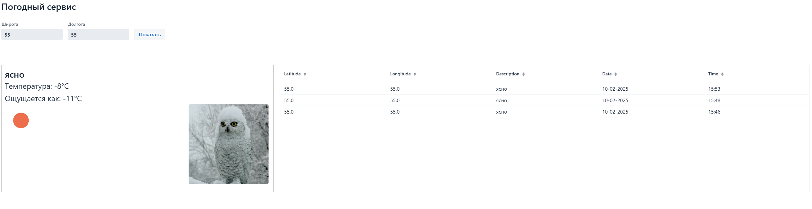
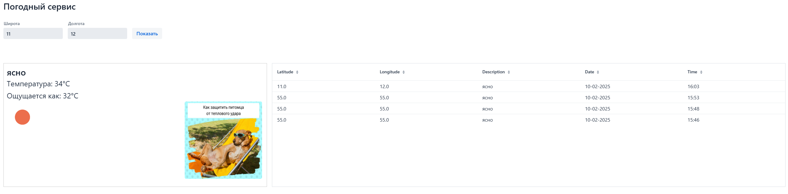

Для экономии Вашего и моего времени креды от БД и API не выносились в .env файл, т.к. хранить его на гитхабе всё равно будет глупо.
  
Стоит отметить, что ответ API при указании языка (ru) всё равно присылал часть ответа на английском, включая "название" погоды. Такая же история и с единицой измерения температуры, так что в коде осуществлен перевод температуры в кельвинах в температуру в цельсиях.
*** 

### Описание сервиса

* Сервис по введенным данным (широта и долгота) выводит текущую погоду по координатам и картинку (картинки всего 3, т.к. бесплатных API для картинок найти не смог);
* История запросов и ответов хранится в бд и выводится пользователю на странице (последние 20 запросов);
* При написании frontend-части использовался только Vaadin (код на Vaadin лежит в view/WeatherView);
* Провалидирован ввод широты и долготы: будет светиться красным блок ввода, если же будет попытка отправки таких данных, то пользователь получит Alert;

***
## Поднятие PostgreSQL
Перед началом работы с сервисом необходимо поднять БД из корневой папки проекта:
`docker-compomse up -d` или `docker-compose up`

***
## Варианты запуска:
***
### **Если используете IntelliJ IDEA:**

Скорее всего, если не отключали авто-подгрузку зависимостей, библиотеки загрузсятся автоматически.

**! Если что-то пошло не так !**

Попробуйте в правом сайдбаре выбрать Maven, перейти в `Lifecycle` и запустите `clean`, затем `install`

***
### **Если используете другую IDE:**

1. Откройте командную строку (можно открыть сразу в папке с проектом) и перейдите в папку с проектом.
2. Выполните команду `mvn dependency:resolve` (Если используется IntelliJ IDEA, то можно просто нажать на команду, она сработает в папке проекта)

*** 
После выполнения всех подготовительных шагов запускаем `VaadinWeatherApplication`, переходим на http://localhost:8080/ и пользуемся :)
